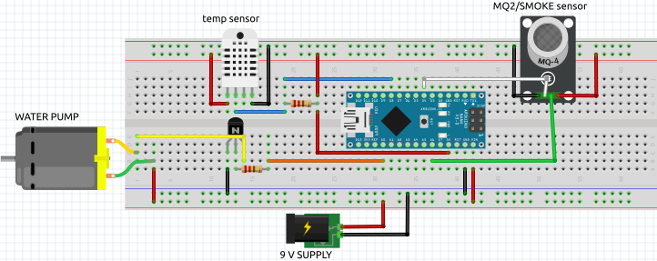

# FIRE ALARM SYSTEM

## Intro

Find a way to keep people safe in case of buildings, came up with simple demo project on the problem

## Working

I first detect the presence of smoke and then check if temp has raisen above the limit. If it becomes the case, i trigger an alarm and open extinguishing mechanism(simple used water pump).

## Components used

1. MQ2 sensor
2. Temp Sensor(DHT11)
3. 9V pump
4. Buzzer
5. Resistors
6. Arduino nano
7. 12V power supply

## Fritizing diagram

The original file is found in [fritzing diagram](./fritzing%20diagram.fzz)

## Arduino code

The code used in the project is found in [Simple Fire Alarm](./fire_alarm/fire_alarm.ino)
